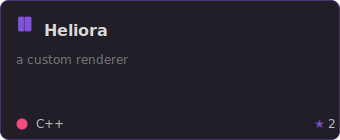
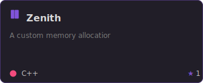
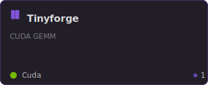
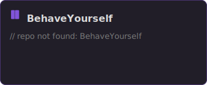
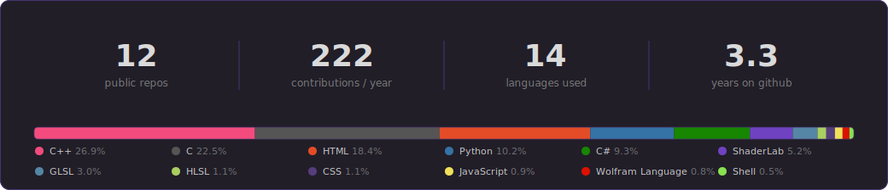
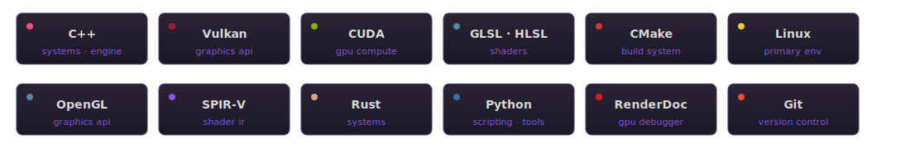

<!-- =========== HERO :: skyline photo =========== -->

  

<!-- =========== TAGLINE :: hand-rolled animated svg =========== -->

  

### whoami

Real-time renderer and engine code. I spend most of my time between the draw call and the swap buffer.
C++ daily, GLSL/HLSL when something is on fire, CUDA when I'm feeling brave.
Currently: learning more of the GPU stack from the bottom up.

### featured

  
  

  
  

<!-- =========== ACTIVITY :: snake + linear flow =========== -->
### activity

<picture>
  <source media="(prefers-color-scheme: dark)"
          srcset="https://raw.githubusercontent.com/Wint3rNight/Wint3rNight/output/snake-dark.svg" />
  <source media="(prefers-color-scheme: light)"
          srcset="https://raw.githubusercontent.com/Wint3rNight/Wint3rNight/output/snake.svg" />
  
</picture>

 

  

### stats

  

### stack

  

### elsewhere

  
  
  
  

