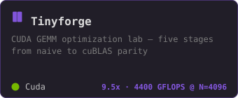
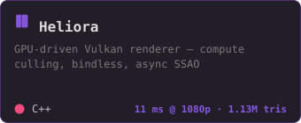
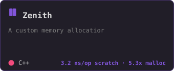
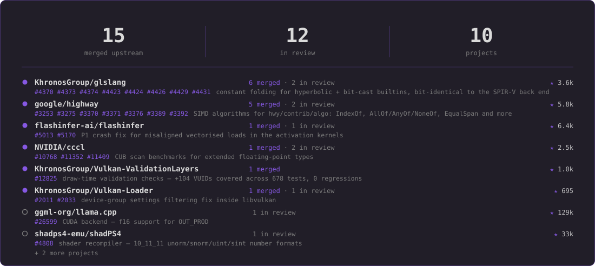
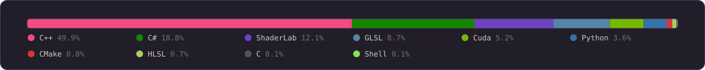
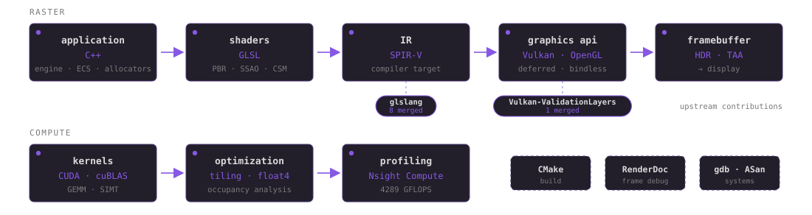
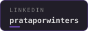
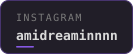
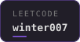

<!-- =========== HERO :: skyline photo =========== -->

  

<!-- =========== TAGLINE :: hand-rolled animated svg =========== -->

  

### whoami

Undergraduate low-level C++ programmer working on GPU and systems performance — CUDA kernel optimization, real-time Vulkan rendering, and merged contributions to the Khronos graphics toolchain.

### featured

  
  
  

<!-- =========== OPEN SOURCE :: generated from the GitHub search API =========== -->
### open source

  

<!-- =========== ACTIVITY :: snake + linear flow =========== -->
### activity

<picture>
  <source media="(prefers-color-scheme: dark)"
          srcset="https://raw.githubusercontent.com/Wint3rNight/Wint3rNight/output/snake-dark.svg" />
  <source media="(prefers-color-scheme: light)"
          srcset="https://raw.githubusercontent.com/Wint3rNight/Wint3rNight/output/snake.svg" />
  
</picture>

 

  

### stats

  

### stack

  

### elsewhere

  
  
  
  

